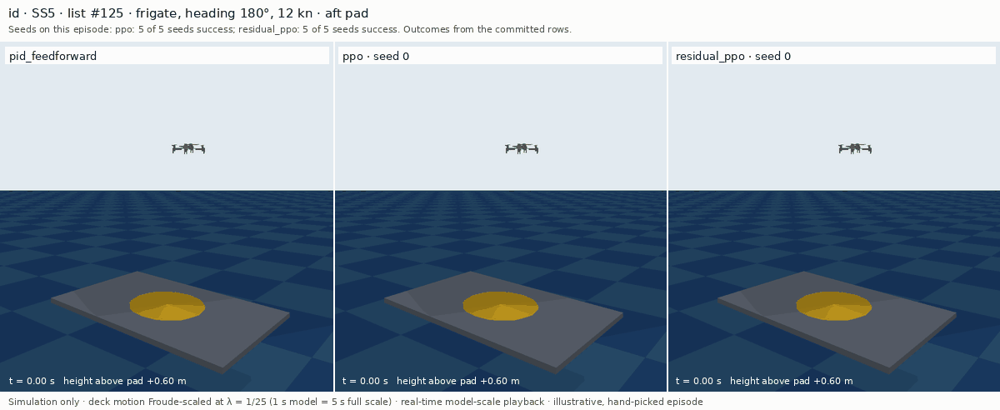
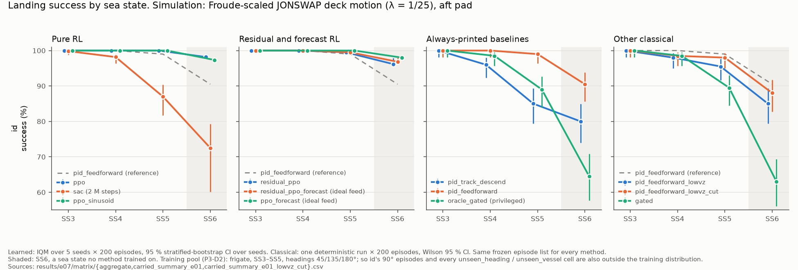
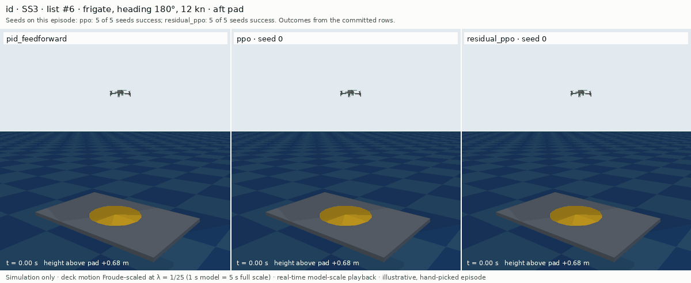
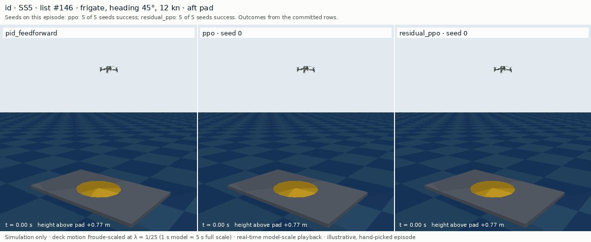
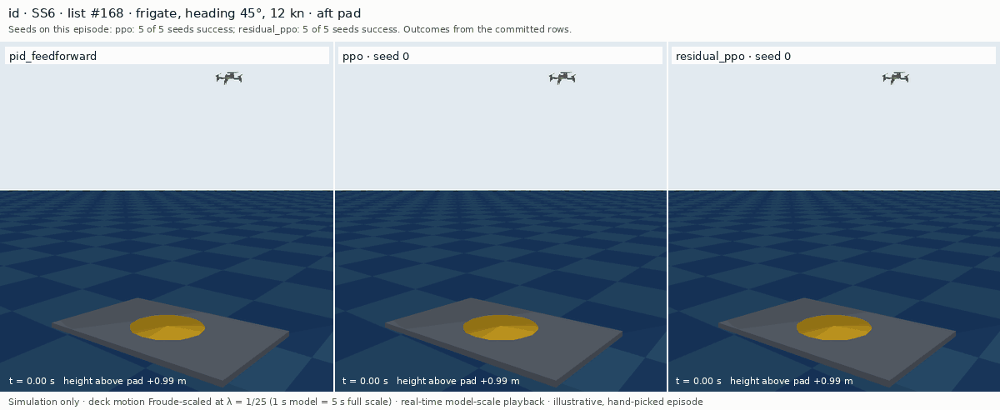
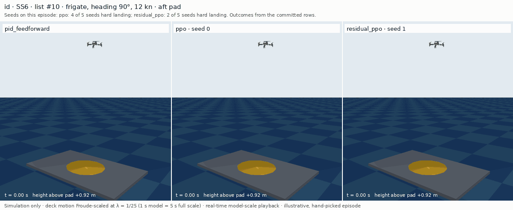
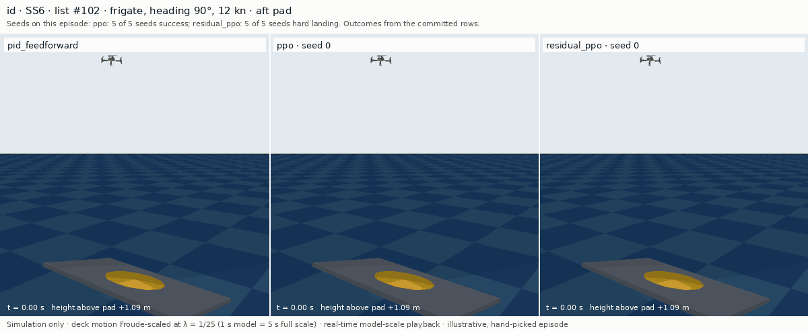
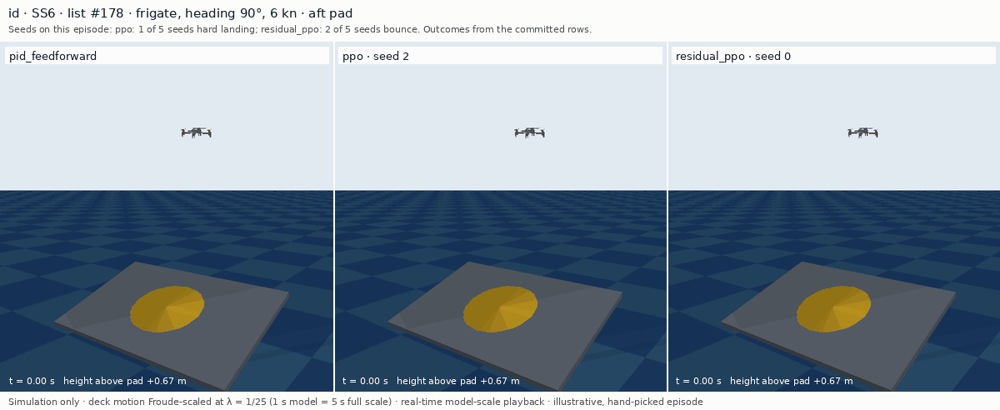
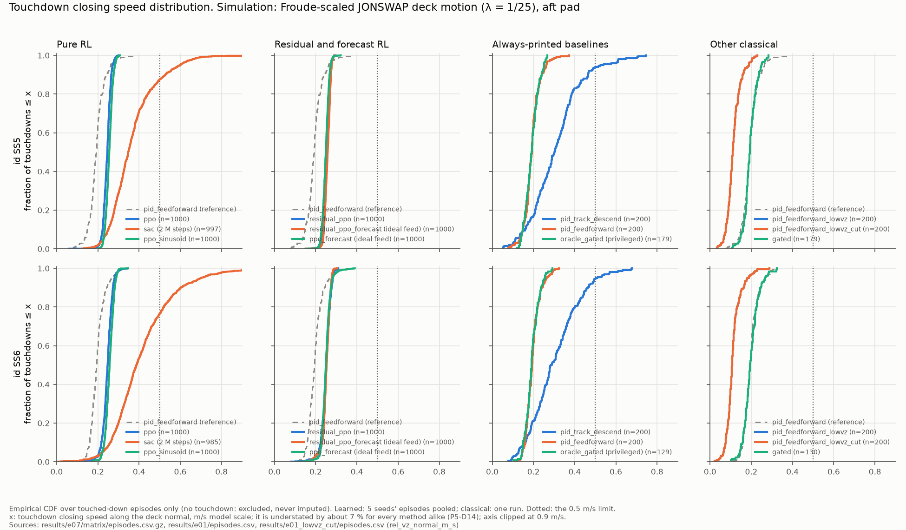

# rl-land-on-moving-deck

Reinforcement-learning landing of a quadrotor on a heaving ship deck, in simulation: a
gym-pybullet-drones Crazyflie 2.x lands on a plate driven by Froude-scaled JONSWAP seakeeping
motion from [`deck-motion-forecast`](https://github.com/kbasak01/deck-motion-forecast) (dmf).
Pure RL (PPO, SAC), residual RL on a PID-plus-feedforward baseline, forecast-conditioned RL and a
sinusoid-trained policy are compared with six classical and two forecast-gated controllers on
frozen, pre-registered
episode lists. Five seeds per learned method; interquartile means with stratified-bootstrap
95 % CIs; paired contrasts for every hypothesis. The study ends with ONNX export and a latency
measurement. **Everything in this repository is simulation. No real flight was flown, no real
deck data is used anywhere, and no sim-to-real claim is made.**

**Status: Phases 0–8 complete; Phase 9 (this release) under audit.**
- Gates 0, 2 and 4–6 passed as written.
- Gate 1 passed after an ambiguous denominator in its feasibility rule was resolved (P1-D1). The
  rejected reading is recorded as FAIL beside it.
- Gate 7 passed with H5 deferred to Gate 8 by a dated user decision (P7-D1 §7).
- Gate 3 **failed** at its first attempt, on the adversarial review and before any RL run. It
  passed at the second attempt, after user decisions logged in P3-D1.
- Gate 8 passed only **under a post-hoc deviation (P8-D5)**. Its closed-loop parity criterion as
  pre-registered (P8-D1 §7) was **not met**: 3 of 4 exported policies matched 49/50 episodes, not
  50/50.
- Phase 7's perception arm was redefined and re-flown under a dated deviation (P7-D4) after review
  found that its stand-in mixed timestamps. The first arm's latency readings are withdrawn.

The findings of Phases 7–9, with every claim withdrawn there, are in
[`docs/findings.md`](docs/findings.md). Every decision, deviation and retraction of every phase,
dated, is in [`docs/protocol.md`](docs/protocol.md).

**The short version.**
- On the frigate at sea states 3–5, every PPO-family method and the best classical baseline
  (`pid_feedforward`) land essentially every episode. These methods differ only at SS6, a sea
  state no method trained on.
- Residual PPO beat its own PID base at `id` SS6 (H1b, +6.0 [+2.0, +10.2] points). The margin over the
  pre-registered line is 1.0 point. That is smaller than what the frozen 50 ms bounce rule decides,
  and of the same order as float32 rounding effects in that cell.
- Plain PPO sits above residual PPO in that cell, an unpaired reading.
- Residual RL did **not** land softer (H1a: it lands 47 % harder than the softest PID).
- It did not generalise better (H2).
- Forecasts did nothing measurable (H3).
- Training on sinusoidal deck motion cost nothing measurable at the scored cell (H4), so **the
  project's motion-realism novelty claim is withdrawn**.
- On the S175 hull and on the MSS records, no learned method is shown to beat
  `pid_feedforward` (unpaired; on S175 the PPO family differs from it by at most two episodes in
  200 per sea state).
- SAC's point estimate sits below `pid_feedforward`'s in every SS5/SS6 cell of every regime.

---

## The landing, and success against sea state



*One `id` SS5 episode (frigate, head seas, 12 kn), re-flown by `pid_feedforward`, `ppo` (seed 0)
and `residual_ppo` (seed 0) from the same start on the same deck motion. Playback is real time at
model scale; at λ = 1/25 the full-scale motion is 5× slower. The episode was hand-picked for visual
clarity (P9-D1), so it is an illustration, not a sample. More, including failures, are in the
[gallery](#gallery-same-episode-three-controllers).*



`id` regime, aft pad, the same 200 listed episodes per sea state for every method. Learned rows
show the IQM over 5 seeds with its stratified-bootstrap 95 % CI, which reflects seed variation
only. Classical rows show one deterministic run with its Wilson 95 % CI. The figure is
regenerated by `make figures` from committed CSVs only. What to read off it:

- **SS3–SS5 sit at the ceiling.** Every PPO-family method scores 99.5–100 %, with degenerate seed
  CIs in most cells. So does `pid_feedforward` (99.0–100 %). These cells cannot rank them.
- **The PPO family and `pid_feedforward` differ only at SS6, a sea state no method trained on.**
  At SS5, `sac` (87.0), `pid_track_descend` (85.0), `gated` (89.5) and `oracle_gated` (89.0) already
  fall below them.
  - The PPO family scores 96.2–98.2 % there, against `pid_feedforward`'s 90.5 % [85.6, 93.8].
  - Only `residual_ppo` vs `pid_feedforward` was tested (H1b). Every other learned-vs-baseline
    comparison in this figure is an unpaired reading.
- **SAC (2 M env steps, against 10 M for PPO) is the clearest case of a classical baseline above an
  RL method.** At `id` SS5 and SS6 its seed CI lies wholly below `pid_feedforward`'s Wilson
  interval: [81.7, 90.3] against [96.4, 99.7], and [60.2, 79.3] against [85.6, 93.8]. That is still
  unpaired.
- **The privileged `oracle_gated` is not a ceiling.** It reads the true future deck motion, but
  stays within a few points of `gated`, and both lose mainly to `timeout`.

The same figure for the three shift regimes is
[`results/figures/success_vs_seastate_shift.png`](results/figures/success_vs_seastate_shift.png).

## Gallery: same episode, three controllers

Six more listed `id` episodes follow, each flown by `pid_feedforward`, `ppo` and `residual_ppo`
from the same start on the same deck motion. They were **hand-picked for visual clarity, failures
included. They are not a sample of the distribution**, and the tables above are the evidence.
- Each learned seed was picked together with its episode. Each caption says how many of that
  method's 5 seeds end the same way on that episode.
- Every panel is a re-flight from the trained checkpoint. It reproduces its committed episode row
  exactly in every recorded column, and the outcome banner is drawn from that row (P9-D1).
- The three beam-seas SS6 episodes are outside the training distribution twice over: in sea
  state and in heading.
- Per-panel numbers are in
  [`results/figures/gifs/manifest.csv`](results/figures/gifs/manifest.csv). Closing speed is along
  the deck normal; tilt is the drone's tilt relative to the deck.

**SS3, head seas, 12 kn: all three land.** `ppo` touches down at 1.45 s and `residual_ppo` at
1.77 s, against `pid_feedforward`'s 3.73 s. That is consistent with the two-phase descent the
PID's constant-descent tuning cannot express; no mechanism was tested. All 5 seeds of each learned method land this episode.



**SS5, 45°, 12 kn: `pid_feedforward` bounces, both RL policies land.** The PID touches down at
0.14 m/s at 10.0° relative tilt and loses contact (`bounce`, under the frozen 50 ms rule). `ppo`
seed 0 and `residual_ppo` seed 0 land; 5 of 5 seeds of each do.



**SS6, 45°, 12 kn: `pid_feedforward` lands hard on a tilted deck.** It lands at 19.2° relative tilt
against the 15° limit. Both RL policies land, and 5 of 5 seeds of each do.



**SS6, beam seas, 12 kn: the PID lands; the RL seeds shown both land hard.** `pid_feedforward`
lands at 3.3° relative tilt.
- `ppo` seed 0 lands hard at 16.3°; 4 of 5 `ppo` seeds land hard here.
- `residual_ppo` seed 1 lands hard at 16.5°; 2 of 5 `residual_ppo` seeds do.

In this episode the RL policies shown touch down at 1.6–2.0 s and the PID at 5.0 s. No mechanism
was tested. On #168 above, the same early RL touchdown goes with RL landing and the PID failing.



**SS6, beam seas, 12 kn: `residual_ppo` lands hard in every seed.**
- `residual_ppo` seed 0 lands at 21.9° relative tilt; all 5 seeds land hard.
- `ppo` lands, and so do all 5 of its seeds.
- `pid_feedforward` bounces.



**SS6, beam seas, 6 kn: all three panels fail (for `ppo`, only the seed shown).**
- `pid_feedforward` lands hard at 18.8°.
- `ppo` seed 2 lands hard at 15.2°. This is the only `ppo` seed of five that fails here; the
  other four land.
- `residual_ppo` seed 0 bounces; 2 of 5 seeds bounce, and 2 others land hard.



## Setup in brief

**The deck is Froude-scaled to the drone, not the drone to the deck** (plan D0.1). The vehicle is
an unscaled Crazyflie 2.x (`cf2x`, 27 g in its URDF). The ship motion is scaled by
λ = L_model / L_full = **1/25**:

| quantity | scale factor | at λ = 1/25 |
|---|---|---|
| length, heave, lever arm | λ | × 0.04 |
| time, period | √λ | × 0.2 (1 s model = 5 s full scale) |
| linear velocity | √λ | × 0.2 |
| linear acceleration, angles | 1 | × 1 |
| angular rate, frequency | 1/√λ | × 5 |

Vertical deck motion at the aft pad, frigate, model scale is below. Each value is the mean over
the 12 frigate cells of each sea state (headings 45/90/135/180°, speeds 0/6/12 kn), from
`results/deck_stats.csv` (findings §4).

| sea state | deck z SD (cm) | deck v_z SD (m/s) |
|---|---|---|
| SS3 | 1.04 | 0.046 |
| SS4 | 2.08 | 0.086 |
| SS5 | 3.41 | 0.134 |
| SS6 | 4.10 | 0.147 |

- **Deck.** dmf synthesises heave, roll and pitch only, so the deck is 3-DOF. It is evaluated
  analytically on the 240 Hz physics grid through `dmf.sim.response.synthesize_motion`, with no
  interpolation of the 10 Hz corpus. The pad sits 0.4 L aft of the centre of gravity. A pad-at-CG
  control arm removes the lever arm (D0.5).
- **One action space for every method.** A world-frame velocity setpoint at 30 Hz is tracked by
  gym-pybullet-drones' `DSLPIDControl`. Speed is capped at 1.5 m/s as a norm, and yaw is held at
  0 (P2-D2).
- **Observations are state-based.** The policy sees 25 inputs: relative pad position and velocity,
  deck normal, relative tilt, pad-plane clearance and own state. The forecast methods get 6 more,
  31 in all.
  - The forecast methods also get an *ideal* past-only ship-motion feed into the DLinear-OLS
    forecaster.
  - Perception is a noise-and-latency stand-in, not vision (D0.2).
- **Success** (P3-D1 §1, `configs/env/success.yaml`, frozen at Gate 3) requires all of:
  - closing speed along the deck normal ≤ 0.5 m/s;
  - lateral offset ≤ 0.10 m;
  - relative tilt ≤ 15°;
  - contact held ≥ 0.5 s, with a 50 ms contact-loss grace.

  Every episode is classified into exactly one of six classes, matched in order: `crash`
  (C) → `off_pad` (O) → `hard_landing` (H) → `bounce` (B) → `success` → `timeout` (T). Only
  `timeout` is a truncation. Episodes last up to 12 s model scale.
- **Four evaluation regimes, split by realization, never by time window** (inherited from dmf):
  - `id`: held-out seeds, SS3–SS6;
  - `unseen_seastate`: SS6 only;
  - `unseen_heading`: 90° beam seas;
  - `unseen_vessel`: the S175 hull.

  No training realization appears in any list.
- **What is outside the training distribution.** Training used the frigate at SS3–SS5, headings
  45/135/180° (P3-D2). So SS6 is outside it, and so are `id`'s 90° episodes, a quarter of every
  `id` cell, and every `unseen_heading` and `unseen_vessel` cell. The figures shade only SS6.
- **Frozen episode lists.** 200 episodes per cell, 13 cells plus a static-pad list. They were
  committed at `0780aaa` before any controller was evaluated. MANIFEST SHA-256 is `e6f30e55…`, and
  `scripts/make_episodes.py --check` re-verifies it.
- **Methods.**
  - Learned: `ppo`, `sac`, `residual_ppo`, `ppo_forecast`, `residual_ppo_forecast` and
    `ppo_sinusoid` (trained only on matched sinusoids).
  - Classical: `pid_track_descend`, `pid_feedforward`, `pid_feedforward_lowvz`,
    `pid_feedforward_lowvz_cut`, `gated` and the privileged `oracle_gated`.
  - Plus two forecast-gated controllers, `gated_forecast` (DLinear-OLS) and `gated_forecast_tcn`.
    They are `gated` with its commit decision taken on a dmf forecast of the deck, fed by the
    same ideal ship-motion channel as the forecast RL methods (P4-D3). They were flown on the
    frozen lists in Phase 4 (`results/e02/`, P4-D4) and are shown in the `id` and SS6 tables
    below.
    - Forecast gating lowered success against `gated` in 19 (DLinear) and 9 (TCN) of 26 cells
      with separated Wilson CIs, and raised it in none (P4-D4).
    - `gated_forecast` timed out on every aft episode, as P4-D4a's pre-registered expectation
      predicted.
    - They were not flown in any Phase 7 arm (CG, noise, sinusoid, λ, MSS), so they are not in the
      figures.
  - The residual adds α = 0.3 of the network's action to `pid_feedforward`'s.
  - Training budgets: PPO family 10 M env steps, SAC 2 M, seeds 0–4 each, none dropped. PPO and
    SAC were each tuned with ≤ 20 trials on a separate tune pool; the other PPO methods inherit
    PPO's settings. Only `pid_track_descend` and `pid_feedforward` were tuned, 20 trials each on the same tune
    pool, with the same budget and search space (P3-D3). `gated` and `oracle_gated` reuse
    `pid_feedforward`'s gains and are not tuned. `pid_feedforward_lowvz` was selected from the
    tuning log by a pre-registered rule, and `lowvz_cut` derived from it by rule, with no trials
    of their own (P3-D1 §5, P5-D2).
- **Statistics** (P3-D1 §4).
  - Learned cells: rliable-style IQM with a stratified bootstrap over seeds (2 000 replicates).
  - Baselines: Wilson intervals.
  - Hypotheses: a paired bootstrap over seeds and then episodes (10 000 replicates).
  - **A difference is claimed only where a paired or stated bootstrap CI excludes 0.**
  - No multiplicity correction was applied.

## Results

Every table below is copied from [`docs/findings.md`](docs/findings.md), which names the
committed CSV behind each number. The one exception is the `id` table's p95 column, which is read
from the CSVs named above that table. [`results/results.md`](results/results.md) renders all of them,
and more, from the CSVs; `make report` re-renders it byte-identically.

**Cell format.**
- Learned rows: IQM [95 % seed-bootstrap CI], N = 5 × 200 = 1 000.
- Baselines: rate [Wilson 95 % CI] k/200.
- After the semicolon: losses by class, as counts per 1 000 (learned) or per 200 (baselines),
  with C crash, O off_pad, H hard_landing, B bounce, T timeout; "–" means none.

The three always-printed baselines are `pid_track_descend`, `pid_feedforward` and the privileged
`oracle_gated`.

### `id` (frigate; aft pad; JONSWAP; λ = 1/25)

Sources: `results/e07/matrix/aggregate.csv`, `summary.csv`, `carried_summary_e01.csv` and
`carried_summary_e01_lowvz_cut.csv`. The two Phase 4 forecast-gated rows, here and in the SS6 shift
table, come from `results/e02/summary.csv` (aft pad). The p95 closing speed is in m/s along the deck normal. For
learned rows it is the IQM of per-seed p95; for baselines it is a single run.

| method | SS3 | SS4 | SS5 | SS6 | p95 closing SS5 / SS6 |
|---|---|---|---|---|---|
| `ppo` | 100.0 [100.0, 100.0]; – | 100.0 [100.0, 100.0]; – | 100.0 [100.0, 100.0]; – | 98.2 [98.0, 98.5]; H15 B3 | 0.271 / 0.278 |
| `sac` (2 M steps) | 99.8 [98.8, 100.0]; H4 | 98.2 [96.3, 99.0]; O1 H20 | 87.0 [81.7, 90.3]; C2 O8 H122 B3 T1 | 72.5 [60.2, 79.3]; C18 O39 H232 B2 | 0.595 / 0.668 |
| `residual_ppo` | 100.0 [100.0, 100.0]; – | 100.0 [100.0, 100.0]; – | 99.5 [99.5, 99.8]; H4 | 96.2 [95.7, 97.8]; H24 B11 | 0.277 / 0.283 |
| `ppo_forecast` (ideal feed) | 100.0 [100.0, 100.0]; – | 100.0 [100.0, 100.0]; – | 100.0 [100.0, 100.0]; – | 98.0 [97.5, 98.5]; H18 B2 | 0.272 / 0.281 |
| `residual_ppo_forecast` (ideal feed) | 100.0 [100.0, 100.0]; – | 100.0 [100.0, 100.0]; – | 99.5 [99.5, 99.5]; H5 | 96.8 [96.5, 98.0]; H25 B4 | 0.278 / 0.278 |
| `ppo_sinusoid` | 100.0 [100.0, 100.0]; – | 100.0 [100.0, 100.0]; – | 100.0 [100.0, 100.0]; – | 97.3 [96.7, 97.8]; H25 B2 | 0.282 / 0.288 |
| `pid_track_descend` | 100.0 [98.1, 100.0] 200/200; – | 96.0 [92.3, 98.0] 192/200; H4 B4 | 85.0 [79.4, 89.3] 170/200; H12 B18 | 80.0 [73.9, 85.0] 160/200; H17 B23 | 0.525 / 0.502 |
| `pid_feedforward` | 100.0 [98.1, 100.0] 200/200; – | 100.0 [98.1, 100.0] 200/200; – | 99.0 [96.4, 99.7] 198/200; H1 B1 | 90.5 [85.6, 93.8] 181/200; H8 B11 | 0.262 / 0.264 |
| `pid_feedforward_lowvz` | 100.0 [98.1, 100.0] 200/200; – | 98.0 [95.0, 99.2] 196/200; B4 | 95.5 [91.7, 97.6] 191/200; B9 | 85.0 [79.4, 89.3] 170/200; H9 B21 | 0.188 / 0.181 |
| `pid_feedforward_lowvz_cut` | 100.0 [98.1, 100.0] 200/200; – | 98.5 [95.7, 99.5] 197/200; B3 | 98.0 [95.0, 99.2] 196/200; B4 | 88.0 [82.8, 91.8] 176/200; H9 B15 | 0.188 / 0.181 |
| `gated` | 100.0 [98.1, 100.0] 200/200; – | 98.5 [95.7, 99.5] 197/200; T3 | 89.5 [84.5, 93.0] 179/200; T21 | 63.0 [56.1, 69.4] 126/200; B4 T70 | 0.250 / 0.267 |
| `oracle_gated` (privileged) | 100.0 [98.1, 100.0] 200/200; – | 98.5 [95.7, 99.5] 197/200; T3 | 89.0 [83.9, 92.6] 178/200; B1 T21 | 64.5 [57.7, 70.8] 129/200; T71 | 0.252 / 0.254 |
| `gated_forecast` (Phase 4; ideal feed) | 0.0 [0.0, 1.9] 0/200; T200 | 0.0 [0.0, 1.9] 0/200; T200 | 0.0 [0.0, 1.9] 0/200; T200 | 0.0 [0.0, 1.9] 0/200; T200 | – / – (no touchdowns) |
| `gated_forecast_tcn` (Phase 4; ideal feed) | 100.0 [98.1, 100.0] 200/200; – | 95.0 [91.0, 97.3] 190/200; T10 | 60.0 [53.1, 66.5] 120/200; T80 | 16.5 [12.0, 22.3] 33/200; T167 | 0.229 / 0.204 |

**Closing speed (unpaired reading).** Over 14 cells (13 regime × SS cells plus `static`, where the
two forecast RL methods were not flown), five
baselines land softer than every PPO-family method in all 14: `pid_feedforward`, `lowvz`,
`lowvz_cut`, `gated` and `oracle_gated`. `pid_track_descend` lands harder than every PPO-family
method in 12 of 14, and `sac` lands hardest of all in 13 of 14. The only paired closing-speed tests
are H1a and H3, below.



The whole distribution at `id` SS5 and SS6 is shown above, over touched-down episodes only, with
learned seeds pooled. Reading the 5th–95th percentile range from the same episode CSVs:
- the PPO family sits between 0.21 and 0.29 m/s in both cells;
- `pid_feedforward` is lower and wider, 0.14–0.26 m/s at SS5 and 0.15–0.26 m/s at SS6;
- `sac`'s and `pid_track_descend`'s tails cross the 0.5 m/s limit. At SS5 and SS6, 12.4 % and
  23.4 % of `sac`'s touchdowns exceed it, and 6.0 % and 5.5 % of `pid_track_descend`'s.

This is descriptive and untested; `make figures` regenerates the figure.

### Under shift: `unseen_seastate`, `unseen_heading`, `unseen_vessel`

SS3–SS5 are at or near the ceiling for the PPO family and `pid_feedforward` in every regime; the
full tables are in [`docs/findings.md` §2](docs/findings.md) and `results/results.md` §1. The SS6
cells, where methods differ:

| method | `unseen_seastate` SS6 | `unseen_heading` SS6 | `unseen_vessel` SS6 |
|---|---|---|---|
| `ppo` | 97.3 [96.0, 98.2]; H23 B5 | 90.7 [86.3, 93.3]; C1 O3 H77 B17 | 99.3 [98.7, 99.5]; H7 B1 |
| `sac` (2 M steps) | 70.2 [62.2, 74.8]; C19 O46 H241 B3 | 46.5 [37.0, 55.2]; C86 O98 H343 B8 T3 | 81.5 [79.0, 84.7]; C3 O23 H153 B3 T1 |
| `residual_ppo` | 95.3 [94.0, 97.2]; H38 B7 | 85.7 [84.0, 89.0]; H107 B31 | 99.0 [98.7, 99.3]; H8 B2 |
| `ppo_forecast` (ideal feed) | 96.7 [96.2, 97.3]; H31 B2 | 87.8 [84.7, 89.3]; O1 H113 B12 | 99.3 [99.0, 99.5]; H6 B1 |
| `residual_ppo_forecast` (ideal feed) | 95.8 [95.0, 96.5]; H35 B7 | 87.5 [84.0, 90.3]; H102 B25 | 99.2 [98.7, 99.5]; H6 B3 |
| `ppo_sinusoid` | 97.5 [96.5, 98.5]; H23 B2 | 86.2 [84.8, 87.8]; H116 B21 | 99.5 [99.0, 100.0]; H5 |
| `pid_track_descend` | 81.0 [75.0, 85.8] 162/200; H15 B23 | 72.5 [65.9, 78.2] 145/200; H22 B33 | 81.5 [75.5, 86.3] 163/200; H20 B17 |
| `pid_feedforward` | 90.0 [85.1, 93.4] 180/200; H6 B14 | 77.0 [70.7, 82.3] 154/200; H24 B22 | 98.5 [95.7, 99.5] 197/200; H1 B2 |
| `pid_feedforward_lowvz` | 86.0 [80.5, 90.1] 172/200; H7 B21 | 70.0 [63.3, 75.9] 140/200; H24 B36 | 95.0 [91.0, 97.3] 190/200; B10 |
| `pid_feedforward_lowvz_cut` | 89.5 [84.5, 93.0] 179/200; H7 B14 | 83.0 [77.2, 87.6] 166/200; H24 B10 | 97.0 [93.6, 98.6] 194/200; B6 |
| `gated` | 64.5 [57.7, 70.8] 129/200; B2 T69 | 42.0 [35.4, 48.9] 84/200; B7 T109 | 90.0 [85.1, 93.4] 180/200; T20 |
| `oracle_gated` (privileged) | 65.0 [58.2, 71.3] 130/200; T70 | 46.5 [39.7, 53.4] 93/200; T107 | 89.0 [83.9, 92.6] 178/200; T22 |
| `gated_forecast` (Phase 4; ideal feed) | 0.0 [0.0, 1.9] 0/200; T200 | 0.0 [0.0, 1.9] 0/200; T200 | 0.0 [0.0, 1.9] 0/200; T200 |
| `gated_forecast_tcn` (Phase 4; ideal feed) | 21.0 [15.9, 27.2] 42/200; T158 | 22.0 [16.8, 28.2] 44/200; T156 | 16.0 [11.6, 21.7] 32/200; T168 |

- **No learned method is shown to beat `pid_feedforward` on the S175 hull** (`unseen_vessel`;
  unpaired, nothing tested).
  - It scores 99.5–100 % at SS3–SS5 and 98.5 % [95.7, 99.5] at SS6.
  - At SS5 every PPO-family point estimate (100.0) is just above its 199/200 Wilson interval
    [97.2, 99.9], by one episode.
  - At SS6 four of the five PPO-family point estimates (99.0–99.3) lie inside its Wilson interval
    [95.7, 99.49]. `ppo_sinusoid`'s 99.5 is just above it.
  - At SS5 four PPO-family seed CIs are a degenerate [100, 100], which by the non-overlap reading
    used for SAC above lies wholly above its interval. Nothing here was tested.
- **`unseen_heading` SS6 (beam seas) is the hardest cell for every method except the two Phase 4
  forecast-gated controllers** (`gated_forecast` scores 0 everywhere; `gated_forecast_tcn`'s worst
  SS6 cell is `unseen_vessel`).
  - The PPO family scores 85.7–90.7 % there, mostly through `hard_landing`, against
    `pid_feedforward`'s 77.0 %. That comparison is unpaired.
  - The pure-PPO methods also have 19–25 tunnelled successes per 1 000 in that cell, which is
    unaudited (see Limitations). That is up to 2.5 points.
- **Within the PPO family nothing is tested.** Plain `ppo` has the highest point estimate in the
  `id` and `unseen_heading` SS6 cells. At `unseen_seastate` and `unseen_vessel` SS6, `ppo_sinusoid`
  is above it (97.5 vs 97.3 and 99.5 vs 99.3), with overlapping CIs. At `id` SS6, the H1b cell, `ppo`'s seed CI [98.0, 98.5] lies wholly above `residual_ppo`'s
  [95.7, 97.8]. That is an unpaired reading.
- The regimes share realizations (P3-D1 §2), so regime-versus-regime differences are not
  independent draws.

### Pad at CG (isolating the lever-arm route of dmf's phase defect)

The same listed episodes are flown with the pad moved to the ship's CG. The aft − CG success
contrast is paired, over 10 000 replicates (`results/e07/contrasts.csv`, findings §3).
- **For the PPO family and the three `pid_feedforward` variants, moving the pad changes success by
  nothing measurable.** None of the 65 PPO-family contrasts separates (5 methods × 13 cells), and
  none of the 39 for `pid_feedforward`, `lowvz` and `lowvz_cut`.
  - So through the lever arm, dmf's in-phase roll/pitch–heave defect does not move these methods'
    success.
  - **That is a non-result in 104 cells, not a demonstrated absence.**
- `pid_track_descend` lands better at the calmer CG: −11.0 [−17.0, −5.5] points at `id` SS5.
- **Unexplained.**
  - SAC is much worse at CG: +23.8 [+11.3, +30.5] points aft − CG at `id` SS6.
  - At `id` SS6 the learned methods' p95 closing speed is higher at CG; the seed CIs separate for
    three of six. Examples: `ppo` 0.278 → 0.295 m/s, `residual_ppo` 0.283 → 0.305.

  Every learned method was trained at the aft pad only.

### Sinusoid test motion (the H4 cross)

The same `id` episodes were flown on each realization's matched sinusoid (findings §5).
- **No PPO-family method loses measurable success on sinusoids.** None of the 20 JONSWAP −
  sinusoid contrasts separates (5 methods × 4 sea states). At SS6, `ppo` scores 99.0 against its
  JONSWAP 98.2, and `ppo_sinusoid` 99.3 against 97.3.
- **The quiescence-gated controllers collapse on sinusoids.**
  - `gated` scores 2.0 % at SS6, with 196/200 `timeout`, a contrast of +61.0 [+54.0, +68.0]
    points. A constant-amplitude sinusoid never offers the quiet window it waits for.
  - `pid_track_descend` loses 20.5 [+13.5, +28.0] points at SS5.

  So motion realism matters for *these* controllers. That is a descriptive, post-hoc reading, not
  H4.

### λ sensitivity (`ppo`, `pid_feedforward`; λ = 1/15, 1/25, 1/40)

Findings §6.
- **Neither `ppo` nor `pid_feedforward` separates from its λ = 1/25 value in any of the 52
  contrasts** (2 methods × 13 cells × 2 λ). These contrasts are unpaired-episode.
- The point estimates tend higher at 1/40, where deck velocities are 0.79× those at 1/25.
- Only the always-printed baselines separate, and only against 1/15:
  - `pid_track_descend` in 3 of 26 cells;
  - `oracle_gated` in 2.

### Perception stand-in (`id`, aft; white noise and latency on the perceived deck)

Full tables are in findings §4 and `results/results.md` §4.
- *This arm was re-flown* under deviation P7-D4, which made the stand-in perceive the deck. The
  superseded first arm is kept only for provenance.
- **Latency alone** (1–2 control steps, 33–67 ms model scale) moves no learned method measurably.
  It costs the PID baselines up to 15 points (`pid_feedforward_lowvz`, SS5, 2 steps).
- **Noise.**
  - At σ_p = 4 cm (σ_v = 0.2 m/s), `pid_feedforward`, `gated` and `oracle_gated` fall to 0–0.5 % at
    every sea state.
  - At SS3 with no latency, for example: `residual_ppo` 2.5 %, `ppo` 79.8 %, `ppo_forecast`
    96.3 %, `pid_feedforward` 0.0 %.
  - **At σ_p = 4 cm the noise exceeds the deck motion at SS3–SS5, and σ_v also exceeds it at SS6.**
    σ_p / deck z SD is 3.86 / 1.92 / 1.17 / 0.98 and σ_v / deck v_z SD 4.31 / 2.33 / 1.49 / 1.36 at
    SS3–SS6 (P7-D6). The calm sea state is not the easy case under noise.
  - The noise is white, i.i.d. per control step; a correlated estimator error of the same σ was
    not tested.
  - Why noise does this was **not tested**.
- **`ppo_forecast`'s robustness is consistent with its ideal side channel (untested).** Its
  ship-motion feed is the one deck-derived input that stays noise-free. Do not read it as a
  forecasting result.

### MSS strip-theory records (described only)

These are records from another simulator (MSS, ITTC S-175, SS5), **not measurements of a real
ship** (findings §7).
- Every PPO-family method lands every MSS episode (1 000/1 000).
- So does `pid_feedforward` (200/200 on both MSS lists).
- **The MSS records do not separate any method from the strongest classical baseline.**

## Hypotheses (pre-registered in P3-D1, scored as written)

Source: `results/e07/hypotheses.csv` (P7-D3) and `results/latency/h5.csv` (P8-D2). Both are
rendered in `results/results.md`.

| H | prediction (P3-D1) | number [95 % CI] | verdict |
|---|---|---|---|
| H1a | `residual_ppo` lowers p95 closing speed vs `pid_feedforward_lowvz` by ≥ 15 % (relative p95, CI excluding 0), `id` SS5, with success non-inferior (CI lower bound ≥ −2 points) | r = −47.0 % [−69.6, −36.8] (0.276 vs 0.188 m/s); non-inferiority +4.1 [+1.2, +7.1] points | **not supported**: the residual lands *harder* |
| H1b | `residual_ppo` − `pid_feedforward` success ≥ 5 points with the CI excluding 0, `id` SS6 | +6.0 [+2.0, +10.2] points | **supported**, with the caveats below |
| H2 | drop(`ppo`) − drop(`residual_ppo`) ≥ 10 points, drop = `id` SS5 → `unseen_seastate` SS6 | drop(`ppo`) − drop(`residual_ppo`) = −1.5 [−4.5, +1.7] points | **not supported** |
| H3 primary | `ppo_forecast` lowers p95 closing speed vs `ppo` by ≥ 10 %, `id` SS5 / SS6; that gain shrinks to ≤ half under `unseen_vessel` | −0.4 % [−2.3, +2.3] / −0.4 % [−6.3, +3.3] | **not supported** / **not supported**; the `unseen_vessel` half-rule is not applicable |
| H3 secondary | the same for `residual_ppo_forecast` vs `residual_ppo`, `id` SS5 / SS6 | −0.8 % [−2.4, +0.9] / +1.9 % [+0.4, +3.8] | **not supported** / **inconclusive** (a fifth of the predicted 10 %); `unseen_vessel` half-rule: not applicable / not scored (no supported `id` gain; met on point estimates only) |
| H4 | drop_sin − drop_jon ≥ 10 points, `id` SS5 (a sinusoid-trained policy loses more on JONSWAP than a JONSWAP-trained one loses on sinusoids); if the CI includes 0 the novelty claim is withdrawn | drop_sin − drop_jon = +0.0 [+0.0, +0.0] (every episode a success) | **not supported**; **novelty claim withdrawn** |
| H5 | at batch 1, the exported policy MLP's p50 on ORT CPU (1 thread) is ≥ 2× lower than on every parity-passing GPU provider | ORT CUDA 4.72× (0.217 vs 0.046 ms p50); ORT TensorRT 3.94× (0.181 vs 0.046 ms); one measurement per configuration, no CI | **supported** |

No multiplicity correction was applied (P3-D4 #9).

**In plain words, with what qualifies each verdict.**

- **H1a: residual RL did not land softer.**
  - `residual_ppo`'s p95 closing speed at `id` SS5 is 0.276 m/s, 47 % above `lowvz`'s 0.188 m/s.
  - The residual pushes its last second *faster* than its own base: a median executed setpoint of
    −0.274 m/s just before touchdown, against `lowvz`'s constant 0.111 m/s descent (P6-D5).
  - It also lands slightly harder than its unmodified base `pid_feedforward` (0.277 vs 0.262 m/s,
    unpaired).
- **H1b: residual RL beat its own PID base at SS6, by a margin that several things can erase.**
  - +6.0 [+2.0, +10.2] points: 965/1 000 against 181/200. The line is 5 points, so the margin is
    **1.0 point**.
  - SS6 is **outside every method's training distribution**.
  - The residual lands in about 2 s with a two-phase descent that the PID's constant-descent tuning
    space cannot express.
  - *The bounce rule.* 11 of `pid_feedforward`'s 19 losses are `bounce`s under the frozen 50 ms
    contact-loss grace, which P5-D1 showed is unstable at 240 Hz. Three of them becoming successes
    would put the point estimate at 4.5, below the line.
  - *Tunnelling alone cannot move it.* Removing all 4 of `residual_ppo`'s tunnelled successes at
    `id` SS6 gives +5.6.
  - *Float32 resolution* (Phase 8). Outcome classes at SS6 near the 15° tilt limit are not
    determined at float32 precision.
    - 53 of 800 `id` SS6 policy-episodes (about 6.6 %) flip under at least one of 20 one-ulp input
      perturbations. This was measured on the four exported policies (`ppo` seeds 0 and 4,
      `residual_ppo_forecast` seeds 0 and 4).
    - The 1.0-point margin is of the same order as the rounding-level per-seed shifts in SS6
      success measured there: −2.5 to +1.5 points under one-ulp noise, and −0.5 to +1.5 under the
      float64 reference, per seed of the exported policies.
    - `residual_ppo` itself was not re-flown.
    - About 30 % of flip events (88 of 291 ulp flips) go through the bounce channel, the rule H1b
      is already fragile to.
  - *Plain PPO is above the residual in the same cell.* `ppo` at 98.2 [98.0, 98.5] lies wholly
    above `residual_ppo` at 96.2 [95.7, 97.8]. That is unpaired and untested.

    So residual RL beats the PID it is built on at SS6, but it is not the best learned method
    there.
- **H2: residual RL did not generalise better across sea state.** `ppo` lost 2.7 points and
  `residual_ppo` 4.2. The difference has the wrong sign and does not separate.
- **H3: the forecast block does nothing measurable to closing speed.** This holds even though the
  forecast methods get an extra *ideal* sensor and trained on in-sample forecasts (P6-D1). In
  success they are within 3 points of their non-forecast twins in every clean cell of the main
  matrix, an unpaired
  reading.
- **H4: at the scored cell, training on sinusoids cost nothing.**
  - `ppo_sinusoid` scores 1 000/1 000 at `id` SS5 on both JONSWAP and sinusoid motion, and so does
    `ppo`. The CI is degenerate because the cell is at the ceiling; P6-D6 foresaw this before
    Phase 7.
  - **The motion-realism novelty claim (plan D0.4) is withdrawn**, and the transfer is the finding.
  - At `id` SS6 `ppo_sinusoid` is weaker, unpaired and untested: its seed CI [96.7, 97.8] lies below
    `ppo`'s [98.0, 98.5]. That does not hold everywhere: at `unseen_seastate` and `unseen_vessel`
    SS6 its point estimate is above `ppo`'s, with overlapping CIs.
- **H5: on this machine, at batch 1, the 512×2 policy MLP runs faster on one CPU thread than on any
  GPU provider.**
  - ORT CPU, 1 thread: 0.046 ms p50 and 0.082 ms p99.
  - ORT CUDA is 4.72× slower and ORT TensorRT 3.94× slower at p50 (p99: 5.57× and 6.97×).
  - The GPU rows include host-device copies by design.
  - See Deployment for what this does not say.

## Deployment: ONNX export and latency (Phase 8)

**What was exported** (P8-D1). `ppo` and `residual_ppo_forecast`, seeds 0 and 4. Each graph is the
deterministic 512×2 tanh actor with the frozen `VecNormalize` statistics and both clips folded in.
The residual's `pid_feedforward` base, the α composition and the DLinear-OLS forecaster stay
outside the graph.

**Numeric parity passes on every provider that was timed.** That covers ORT CPU, CUDA and
TensorRT, and torch on CPU and CUDA: 1 000 observations × 5 draws, TF32 off. The worst max error is
9.5e-7 against a 1e-4 threshold. No configuration was refused.

**Closed-loop parity is reported with both verdicts.**
- **As pre-registered (P8-D1 §7, 50/50 identical outcome classes): not met.**
  - `residual_ppo_forecast` seed 0 matched 50/50.
  - The other three policies matched 49/50. Each differed in one SS6 episode, `success` ↔
    `hard_landing`, landing at 12–16° relative tilt against the 15° limit.
  - A pre-registered investigation (P8-D3/D4) found **rounding sensitivity, not an export defect**:
    - the graph matches SB3 to ≤ 9.5e-7 on all 13 755 flown inputs;
    - a one-ulp nudge of the PyTorch input, with no ONNX involved, flips the same episodes.
- **Under the post-hoc deviation P8-D5 (user decision): met for ORT CPU only.**
  - The criterion: no more flips than the worst of 20 one-ulp-perturbed PyTorch paths, with every
    flip in the rounding-sensitive set.
  - That yardstick is lenient and biased (P8-D6). The floor is a per-step dithering perturbation
    2–4× larger than the export error, and pooled, it is biased toward fewer successes through the
    bounce channel.
  - ORT CUDA is not judged. It would fail that criterion for 2 of 4 policies, and it was scoped out
    after this was seen.
  - ORT TensorRT and torch-eager CUDA were never flown closed loop.

**Latency (one measurement per configuration, no CI).** Every number below was measured on one
machine, a desktop RTX A4000 and an i9-10980XE under WSL2. H5 is judged on ratios between rows on
that machine; the absolute milliseconds do not transfer to any other computer.
- Batch 1, one CPU thread: ORT CPU 0.046 ms p50; ORT CUDA 0.217 ms; ORT TensorRT 0.181 ms;
  torch-eager CUDA 0.404 ms.
- With 2–8 threads, ORT CPU takes 0.018–0.021 ms at batch 1.
- At batch 32, ORT CPU at one thread (0.156 ms) is still faster than ORT CUDA (0.243 ms) and ORT
  TensorRT (0.196 ms). More CPU threads are faster still.
- The likely causes of the GPU penalty were not measured separately: host↔device copies, kernel
  launch overhead on a tiny MLP, and WSL2's GPU paravirtualisation.

**End-to-end per control step** (`results/latency/e2e_budget.csv`, in full simulated episodes, one
thread):

| | p50 | p99 | share of the 33.3 ms period at p99 |
|---|---|---|---|
| `ppo`: observation build + policy | 0.19 ms | 0.30 ms | 0.9 % |
| `residual_ppo_forecast`: observation build + forecaster + policy + base + compose | 0.85 ms | 1.13 ms | 3.4 % |

- The DLinear-OLS forecaster is the largest part (0.53 ms p50).
- Physics stepping and the ship-motion feed are simulation and are reported apart.
- **These totals omit the velocity tracker** `DSLPIDControl` (setpoint to motor RPM). It runs inside
  `env.step` and is booked with physics, and it was not re-timed.
- **Nothing here says anything about an embedded flight computer.** None was measured, and no
  real-flight implication is intended.

## Limitations

Read these before reading any number above.

**The simulation**

- **Simulation only.** PyBullet, gym-pybullet-drones' Crazyflie 2.x and dmf's linear seakeeping
  model throughout. No real flight was flown and no real deck data is used. The MSS records are
  another simulator's output. Nothing here is evidence about a real ship or a real aircraft.
- **Froude scaling at λ = 1/25, with an unscaled vehicle.**
  - The ship motion is scaled; the Crazyflie is not. Any claim is therefore about the deck's motion
    relative to this vehicle's capabilities, not about a full-scale aircraft on a full-scale ship.
  - The plan (D0.1) promised a dimensionless deck-to-vehicle *bandwidth* ratio. **It was never
    measured.**
  - The committed dimensionless numbers are speed ratios. The Gate 1 reference deck-point v_z p99
    (frigate, SS6, head seas, 12 kn, aft) is 0.577 m/s (`results/deck_feasibility.csv`). That is
    0.069 of the CF2X's 8.33 m/s URDF maximum speed, 0.38 of the 1.5 m/s action cap, and 1.15× the
    0.5 m/s touchdown limit.
  - λ = 1/15 and 1/40 move neither `ppo` nor `pid_feedforward` measurably.
- **A 3-DOF deck.** Heave, roll and pitch only, with no surge, sway or yaw. Seas are unidirectional
  and linear, and there is no process noise in the generator.
- **State-based observations.**
  - The policy observes relative deck state directly. Perception is a white-noise-and-latency
    stand-in, not a vision estimator.
  - The forecast methods' ship-motion feed and `oracle_gated`'s future trajectory are ideal
    channels.
- **dmf's phase defect is carried, not fixed.**
  - dmf puts roll and pitch in phase with heave where strip theory puts them in quadrature, about
    90° off.
  - At an aft pad this changes the vertical motion the drone lands on. Every learned method was
    trained on, and may have learned, that wrong coupling.
  - The pad-at-CG control removes the lever-arm route. It moves no PPO-family or `pid_feedforward`
    success measurably, but that is a non-result in 104 cells, not proof the defect is harmless.
  - The defect's other routes are not isolated.
- **Relation to prior art: Angelis, Bauersfeld, Scaramuzza and Boukas (arXiv:2605.23717).**
  - That work is the closest prior art and is *vision-based*. This project is state-based, does
    not compete with it on perception, and makes no claim about vision.
  - The defensible gap was meant to be platform-motion realism: JONSWAP seakeeping motion against
    the sinusoidal platform motion used in that line of work. Here "Angelis-style" means per-DOF
    amplitude matched to RMS and period matched to the peak encounter period.
  - **H4 found no measurable cost of training on sinusoids at the pre-registered cell, so that
    novelty claim is withdrawn.**

**The evaluation**

- **Ceilings and degenerate CIs.**
  - The PPO family is at 100 % with seed CI [100.0, 100.0] in nearly every SS3–SS5 cell. Those
    intervals record a ceiling, not precision.
  - Seed-bootstrap IQM CIs also leave out episode-level uncertainty. A 200/200 seed has a Wilson
    interval of [98.1, 100.0].
- **The bounce label is fragile.** `bounce` is decided by a frozen 50 ms contact-loss grace and is
  unstable at 240 Hz (P5-D1). About 80 % of `lowvz`'s bounces are rim-first rocking.
- **Closing speed is understated by about 7 %**, for every method alike, through when it is
  sampled (P5-D14).
- **Tunnelling.**
  - Successes with > 5 mm penetration at any contact substep are counted, and at `id` they are
    audited (P5-D14, P6-D5).
  - **Outside clean `id` they are unaudited.** At `unseen_heading` SS6 the pure-PPO methods have
    19–25 tunnelled successes per 1 000.
- **`below_deck` crashes are a scoring artifact.** The bound is a fixed 0.3 m model-scale value and
  is not λ-scaled. One `pid_feedforward` success at λ = 1/15 was pre-empted by it (P7-D5).
- **Touchdown detectors.**
  - Analytic and contact detection disagree on 17 of 82 000 learned matrix episodes (0.021 %).
  - That is below Gate 2's 1 % overall. The worst single cell is 3.5 % (`sac` seed 0,
    `unseen_heading` SS6). That figure is learned-only (`results/e07/matrix/summary.csv`).
  - In the three σ_p = 4 cm noise conditions, all 12 methods together disagree on 349, 369 and 375
    of 28 800 episodes: 1.21 / 1.28 / 1.30 % (`results/e07/noise/sigma4cm_*/summary.csv` +
    `baselines_summary.csv`).
- **SAC's budget is not equal.** It had 2 M env steps against 10 M for the PPO family, and every
  PPO-versus-SAC reading carries that confound.
- **No multiplicity correction** across the scored hypothesis parts. The regimes share
  realizations, so regime-versus-regime differences are not independent draws.
- **Hard landings in the audited `id` cells are tilt events.** This holds for the four Phase 6
  methods, `ppo` and `pid_feedforward`; `sac`'s and `pid_track_descend`'s are mostly speed-driven
  (P6-D5).
- **Float32 resolution at SS6.** About 6.6 % of `id` SS6 policy-episodes are rounding-sensitive.
  That was measured on the four exported policies (`ppo` and `residual_ppo_forecast`, seeds 0 and
  4), and it qualifies the per-episode resolution of every committed SS6 success count (Phase 8).
- **The GIFs are hand-picked.** They show what an outcome looks like, not how often it happens.
  Every panel is a re-flight that reproduces its committed row: every recorded episode column
  compares equal as text (P9-D1).

## Reproducing this

```bash
git clone --recurse-submodules https://github.com/kbasak01/rl-land-on-moving-deck
cd rl-land-on-moving-deck
python3.12 -m venv .venv && . .venv/bin/activate
pip install -e third_party/deck-motion-forecast   # must be editable: dmf resolves its configs from its source tree
pip install -e third_party/gym-pybullet-drones
pip install -e ".[dev]"                            # pybullet 3.2.7 builds from sdist on 3.12: needs build-essential, python3.12-dev
make lint && make test                             # ruff + mypy --strict; the test suite (about 14 min)
make all                                           # every stage below except training; needs the trained checkpoints
```

See [`SETUP.md`](SETUP.md) for the environment in detail.

**`make all` needs the trained checkpoints.** `eval`, `bench` and `bench-investigate` fly them.
`make gifs`, which is not in `all`, also re-flies them. They live in the gitignored `artifacts/runs/` and are produced by training
(below), so on a fresh clone train first.
- `eval_phase7.py --check` and `eval_learned.py --check` re-derive their CSVs from the committed
  episode rows, so they do not need the checkpoints.
- Nor do the cheap targets further down.
- `make bench-check` (re-exports the graphs) and `make bench-investigate-check` (re-flies) do.

**Wall clock per stage** (from [`results/runtime_stages.csv`](results/runtime_stages.csv), which
`make runtimes` collects):
- One machine: i9-10980XE, 36 logical CPUs, RTX A4000, WSL2.
- Each stage was run once, mostly at 24 workers.
- **Bold** rows come from committed stage records and are traceable from a clone. The rest were
  copied from gitignored logs and status files, or timed in Phase 9; for those the CSV is the
  only committed record.

| stage | target | wall clock | source |
|---|---|---|---|
| deck-point statistics, 96 cells × 2 pads | `make deck-stats` | 3.6 min | measured in Phase 9, outputs to a temp dir (recorded only in the CSV) |
| environment sanity episodes | `make env-sanity` | **15 s** | `results/e00_env_sanity.csv` |
| classical baselines on the frozen lists | `make baselines` | **8.8 min** | `results/e01/run_info.json` |
| dmf corpus (2 304 realizations) | `make dmf-forecasters` | 18.5 s | `artifacts/dmf/corpus.log` |
| closed-form forecaster fits | `make dmf-forecasters` | 2.1 min | `artifacts/dmf/fit_closed_form.log` |
| TCN and TCN-quantile fits, 3 seeds each (GPU) | `make dmf-forecasters` | **4.55 h** | `results/forecast/fit_manifest.json` |
| Phase 7 evaluation, all six arms + scoring (re-flown noise arm) | `make eval` | **4.88 h**, plus an untimed `--compress` pass | `results/e07/run_info.json` |
| ONNX export, parity, closed loop, latency, e2e budget | `make bench` | **4.7 min** | `results/latency/run_info.json` |
| closed-loop parity investigation | `make bench-investigate` | **11.9 min** | `results/latency/closed_loop_investigation/run_info.json` |
| render `results/results.md` | `make report` | 2.3 s (`--check`) | measured in Phase 9 (recorded only in the CSV) |
| figures | `make figures` | seconds | — |

**Training is not in `make all`.** It runs detached for days and is launched by hand
(`make sweep CFG=configs/rl/<method>.yaml`, `make tune`). The table sums each run's wall clock.
Runs shared the machine (up to 4 at once under a 34-slot CPU cap), so elapsed calendar time was
shorter.

| runs | wall clock, summed over runs | source |
|---|---|---|
| `ppo`, 5 × 10 M steps | 15.2 h | `artifacts/runs/ppo/*/status.json` |
| `sac`, 5 × 2 M steps | 60.4 h | `artifacts/runs/sac/*/status.json` |
| `residual_ppo`, 5 × 10 M | 16.3 h | `artifacts/runs/residual_ppo/*/status.json` |
| `ppo_forecast`, 5 × 10 M | 27.9 h | `artifacts/runs/ppo_forecast/*/status.json` |
| `residual_ppo_forecast`, 5 × 10 M | 26.7 h | `artifacts/runs/residual_ppo_forecast/*/status.json` |
| `ppo_sinusoid`, 5 × 10 M | 11.9 h | `artifacts/runs/ppo_sinusoid/*/status.json` |
| PPO hyperparameter search (18 trials) | **10.4 h** | `results/tune/ppo/trials.csv` |
| SAC hyperparameter search (20 trials) | **60.8 h** | `results/tune/sac_v2/trials.csv` |
| SAC search, first attempt (superseded, P5-D10) | 36.2 h | `artifacts/runs/tune_sac/*/*/status.json` |

Smaller flights from earlier phases (`e01_lowvz_cut`, `e02`, `e02_tcn_seeds`; 0.7 h together) are
listed in the CSV. Smoke runs and diagnostic runs are not.

**Cheap targets.** `make report`, `make figures` and `make runtimes` read committed files only.
`make test` runs about 14 min of simulation but needs no checkpoints.
- On a fresh clone, the tests that need checkpoints or the dmf corpus skip.
- The only skip in the suite as run here is `tests/test_platform.py:191`, by design.

| command | what it does |
|---|---|
| `make report` | re-render `results/results.md` from the CSVs; `python scripts/report.py --check` compares bytes |
| `make figures` | re-render the two success-vs-sea-state figures from committed CSVs |
| `make runtimes` | re-collect `results/runtime_stages.csv` |
| `make test` / `make lint` | the test suite (simulation, no checkpoints needed); ruff + mypy --strict |

**What is and is not committed.**
- `results/` is committed in full: every episode-level CSV (gzipped for Phase 7), every summary,
  the hypotheses, the latency tables, the figures and the GIFs.
- `artifacts/` is gitignored and is regenerated by the stages above and by training: the dmf corpus,
  the forecasters, the checkpoints, the ONNX graphs and the logs.
- Seeds are fixed and recorded.
- These scripts have a `--check` mode that byte-compares against the committed files:
  - `eval_phase7.py` and `eval_learned.py` re-derive from the committed episodes;
  - `bench.py` re-exports and re-checks parity and the closed loop;
  - `closed_loop_investigation.py` re-flies;
  - `make_episodes.py` re-hashes the frozen lists;
  - `report.py` re-renders.
- `eval_baselines.py` compares against a reference directory (`--reference-dir`).
- `deck_stats.py`, `env_sanity.py` and `reward_hacking_audit.py` have no check mode. Their outputs
  are re-derivable but not automatically compared.
- `make gifs` re-flies the gallery and fails if any panel differs from its committed row.

**Committed results that `make all` does not regenerate**, and what does:

| results | produced by |
|---|---|
| `results/e01_lowvz_cut/`, `results/e02/`, `results/e02_tcn_seeds/` | `scripts/eval_baselines.py` (Phases 4–5; the e02 command is in its docstring, the `e01_lowvz_cut` one in P5-D3) |
| `results/e05/`, `results/e06/` (episodes, learning curves) | `scripts/eval_learned.py`, `scripts/export_learning_curves.py` (P5-D13, P6-D4) |
| `results/audit/`, `results/audit/e06/` | `scripts/reward_hacking_audit.py` (commands in each README) |
| `results/tune/` | `make tune CFG=configs/rl/tune_<method>.yaml` |
| `results/mss/` | `make mss-export` (network fetch of MSS, optional Octave) |
| `results/forecast/*.csv` | `make forecast-report` (after `make dmf-forecasters`) |
| `results/env_throughput*.csv` | `make throughput`, `make throughput-landing` |
| `results/episodes/` (the frozen lists) | `scripts/make_episodes.py`; generated once at `0780aaa` and since only verified (`--check`, run by `make eval`) |
| `results/episodes_mss/` | `scripts/make_episodes.py --mss` (needs `make mss-export`) |
| `results/e01/tuning_*.csv`, `results/e01/tune_pool_final.csv` | `scripts/tune_controller.py` (P3-D3; no make target) |
| `results/p5_bounce_check/` | `scripts/p5_bounce_check.py`, `p5_bounce_check_report.py`, `p5_contact_probes.py` (P5-D1) |
| `results/figures/gifs/` | `make gifs` (needs the checkpoints) |
| `results/runtime_stages.csv` | `make runtimes` |

So `make all` regenerates the frozen-protocol evaluation, deployment and report path, not every
committed directory. Plan §1 item 7, "`make all` reproduces everything", is met only together
with the targets above.

## Documentation

| | |
|---|---|
| [`docs/findings.md`](docs/findings.md) | The findings of Phases 7–9 (evaluation, deployment, release), every withdrawn claim beside what replaced it. Start here. Earlier phases' findings and retractions are in the protocol. |
| [`docs/protocol.md`](docs/protocol.md) | The complete decision log: every gate, deviation, retraction and threshold, dated. P3-D1 is the frozen evaluation protocol. |
| [`results/results.md`](results/results.md) | The machine-generated evaluation report, every table naming its source CSV. A reference, not a document to read front to back. |
| [`docs/IMPLEMENTATION_PLAN.md`](docs/IMPLEMENTATION_PLAN.md) | The original plan. Where it and the protocol disagree, the protocol is what happened. |
| [`results/audit/`](results/audit/) | The reward-hacking audits of the final checkpoints (Phases 5 and 6). |
| [`results/e05/`](results/e05/), [`results/e06/`](results/e06/) | Learning curves, 5 seeds, mean ± SD. **The tune-pool panels of `learning_curves_ppo_sinusoid.png` are on sinusoid motion**, that method's training motion, not JONSWAP; the figure itself does not say so. |
| [`results/latency/`](results/latency/) | ONNX parity, closed-loop parity and its investigation, latency, the end-to-end budget, H5. |
| [`docs/audit_report.md`](docs/audit_report.md) | The pre-release audit. |
| [`THIRD_PARTY_NOTICES.md`](THIRD_PARTY_NOTICES.md) | Submodules, derived passages and dependency licenses. |

## Citations

- **Closest prior art** — A. Angelis, L. Bauersfeld, D. Scaramuzza and N. Boukas, arXiv:2605.23717.
- **gym-pybullet-drones** — J. Panerati, H. Zheng, S. Zhou, J. Xu, A. Prorok and A. P. Schoellig
  (2021), *Learning to Fly — a Gym Environment with PyBullet Physics for Reinforcement Learning of
  Multi-agent Quadcopter Control*, IROS.
- **PyBullet** — E. Coumans and Y. Bai (2016–2021), *PyBullet, a Python module for physics
  simulation for games, robotics and machine learning*, <http://pybullet.org>.
- **Stable-Baselines3** — A. Raffin, A. Hill, A. Gleave, A. Kanervisto, M. Ernestus and
  N. Dormann (2021), *Stable-Baselines3: Reliable Reinforcement Learning Implementations*, JMLR
  22(268).
- **PPO** — J. Schulman, F. Wolski, P. Dhariwal, A. Radford and O. Klimov (2017), *Proximal Policy
  Optimization Algorithms*, arXiv:1707.06347.
- **SAC** — T. Haarnoja, A. Zhou, P. Abbeel and S. Levine (2018), *Soft Actor-Critic: Off-Policy
  Maximum Entropy Deep Reinforcement Learning with a Stochastic Actor*, ICML.
- **Residual RL** — T. Johannink et al. (2019), *Residual Reinforcement Learning for Robot
  Control*, ICRA; T. Silver, K. Allen, J. Tenenbaum and L. Kaelbling (2018), *Residual Policy
  Learning*, arXiv:1812.06298.
- **IQM and stratified bootstrap** — R. Agarwal, M. Schwarzer, P. S. Castro, A. Courville and
  M. G. Bellemare (2021), *Deep Reinforcement Learning at the Edge of the Statistical Precipice*,
  NeurIPS.
- **Wilson interval** — E. B. Wilson (1927), *Probable Inference, the Law of Succession, and
  Statistical Inference*, JASA 22(158).
- **JONSWAP and sea states** — K. Hasselmann et al. (1973), Deutsche Hydrographische Zeitschrift
  A8(12); DNV-RP-C205, *Environmental Conditions and Environmental Loads*.
- **Vessel motion, RAOs, encounter frequency** — T. I. Fossen (2021), *Handbook of Marine Craft
  Hydrodynamics and Motion Control*, 2nd ed., Wiley.
- **DLinear** — A. Zeng, M. Chen, L. Zhang and Q. Xu (2023), *Are Transformers Effective for Time
  Series Forecasting?*, AAAI.
- **MSS** — T. I. Fossen and T. Perez, *Marine Systems Simulator*,
  <https://github.com/cybergalactic/MSS>.
- **deck-motion-forecast** — the deck-motion generator and forecasters this project consumes,
  <https://github.com/kbasak01/deck-motion-forecast>.

## License

MIT — see [LICENSE](LICENSE). Third-party components and their licenses are listed in
[THIRD_PARTY_NOTICES.md](THIRD_PARTY_NOTICES.md).

Simulated results only. No real flight and no real deck data are used anywhere in this project.
